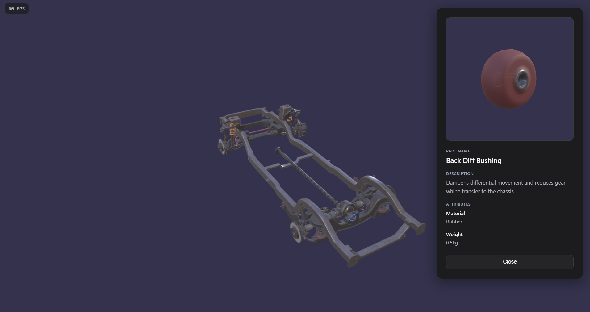

# WebGL Technical Assessment

This project is a browser-based viewer for a vehicle rolling-chassis assembly. It loads a GLB model with **Babylon.js**, lets users pick individual components, and shows part metadata in a side panel with a focused 3D preview.



## Which model is used

- **File:** `public/Falcon FG FGX Chassis Full.glb`.

## How selectable areas are implemented

Selection is **mesh picking** driven by Babylon's built-in ray picking:

1. **Pointer flow** — On pointer down, the engine records the picked mesh and world hit point. A small **drag threshold** (pixels) ensures camera orbit/drag does not count as a click.
2. **Component root** — glTF often splits one logical part into primitives named like `…_primitive0`. The code walks up the parent chain until the name no longer matches that pattern, so one click targets the **whole component** for highlighting and metadata.
3. **What is pickable** — Not every surface is selectable. After load, **`applyRedComponentPickability`** sets `isPickable` only on meshes whose **PBR albedo** reads as **red** (with tuned thresholds). Non-red geometry (e.g. neutral/gray shells) stays non-pickable so rays can reach red-highlighted parts behind them.
4. **Visual feedback**
- The selected component gets a **selection outline** (`SelectionOutlineLayer`) and a **pulsing outer glow** (`HighlightLayer`) in a blue tint.
- Hover uses `scene.pick` at the pointer to toggle a **pointer** cursor when over a pickable mesh.

The modal's isolated view reuses a **cloned subtree** of the picked component in a secondary engine/canvas (see `src/ui/modalPreview.ts`).

## How part data is mapped to meshes

Metadata lives in **`public/parts.json`**. At runtime the app fetches it and builds a map **id => part record** (`src/data/parts.ts`).

- **Key rule:** Each part's **`id` is expected to match the component root node name** from the GLB (the same name `resolveComponentRoot` resolves to after merging primitives).
- **Duplicates:** Names like `PartName.001` are normalized for lookup by stripping a trailing **`.digits`** suffix so they still match the canonical `id` in JSON.

Fields used in the UI typically include **`name`**, **`description`**, and **`attributes`** (arbitrary key/value strings, e.g. material and weight).

## Production-oriented improvements

- **Loading and errors**: Show a proper loading state and handle model load failures.
- **Responsive layout**: Make the canvas and modal scale and reflow for small screens and touch.
- **Performance**: Use LOD or simplified meshes for distant parts; consider compressing or streaming the GLB, load texture seperately.
- **Part data**: Support localization for names and descriptions.

## Local development

Requires **Node.js ≥ 20**.

```bash
npm install
npm run dev
```

Build for static hosting:

```bash
npm run build
npm run preview
```

## Tech stack

- **Vite** + **TypeScript**
- **Babylon.js** (`@babylonjs/core`, `@babylonjs/loaders`) for WebGL rendering, glTF import, picking, and highlight/outline layers
